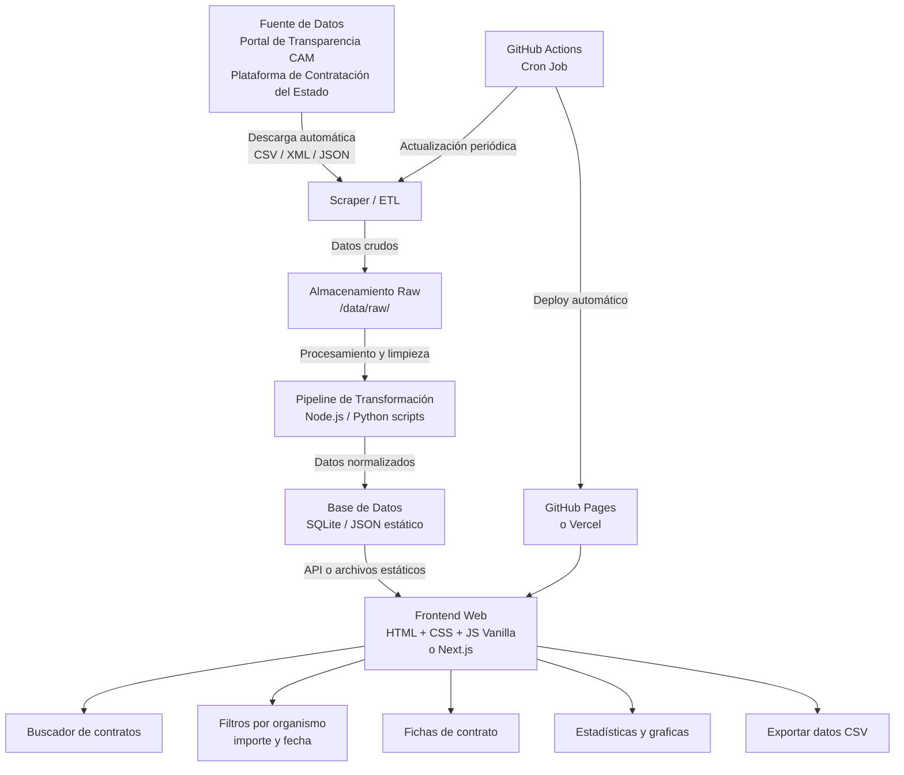
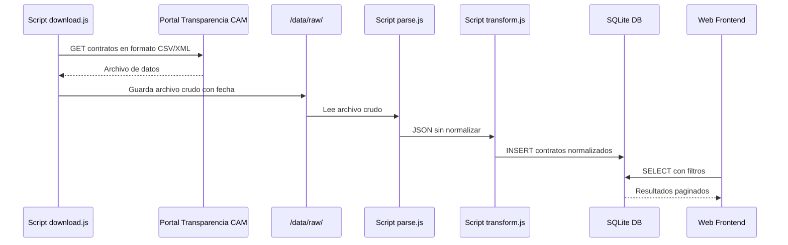

# Arquitectura Técnica — ContratosCAM

## Visión General

**ContratosCAM** es una aplicación web de transparencia pública que descarga, procesa y visualiza los datos de contratación pública de la Comunidad de Madrid, inspirada en [contratosdecantabria.es](https://contratosdecantabria.es) de Jaime Gómez-Obregón.

---

## Diagrama de Arquitectura del Sistema



---

## Stack Tecnológico Recomendado

### Para un estudiante de DAM de 1er año

| Capa | Tecnología | Por qué |
|------|-----------|---------|
| **Scraping / ETL** | Node.js + `node-fetch` + `csv-parse` | Ya conoces JS, fácil de aprender |
| **Base de datos** | SQLite (via `better-sqlite3`) | Sin servidor, un solo archivo, SQL estándar |
| **Backend API** | Express.js (opcional) | Simple y muy documentado |
| **Frontend** | HTML + CSS + JS Vanilla | Control total, sin magia |
| **Gráficas** | Chart.js | Librería sencilla y potente |
| **Tablas** | DataTables.js | Búsqueda y filtros gratis |
| **Deploy** | GitHub Pages + GitHub Actions | Gratis, integrado con tu repo |

### Alternativa más moderna (cuando tengas más experiencia)
- Frontend: **Next.js** (React)
- Base de datos: **Turso** (SQLite en la nube)
- Deploy: **Vercel**

---

## Estructura de Directorios

```
contratoscam/
├── .github/
│   └── workflows/
│       └── update-data.yml       # GitHub Action para actualizar datos
├── data/
│   ├── raw/                      # Datos descargados sin procesar
│   │   └── .gitkeep
│   ├── processed/                # Datos limpios y normalizados
│   │   └── .gitkeep
│   └── db/
│       └── contratos.db          # Base de datos SQLite (gitignored si es grande)
├── docs/
│   ├── fuentes-datos.md          # Documentación de las fuentes
│   └── capturas/                 # Screenshots para el README
├── plans/
│   ├── arquitectura.md           # Este archivo
│   └── roadmap.md                # Hoja de ruta
├── scripts/
│   ├── download.js               # Descarga datos de la fuente
│   ├── parse.js                  # Parsea CSV/XML a JSON
│   ├── transform.js              # Limpia y normaliza datos
│   └── import-db.js              # Importa datos a SQLite
├── src/
│   ├── api/
│   │   └── server.js             # Servidor Express (opcional)
│   └── web/
│       ├── index.html            # Página principal
│       ├── contrato.html         # Ficha de contrato
│       ├── css/
│       │   └── styles.css
│       └── js/
│           ├── app.js            # Lógica principal
│           ├── search.js         # Búsqueda y filtros
│           └── charts.js         # Gráficas
├── .gitignore
├── package.json
└── README.md
```

---

## Flujo de Datos (ETL)



---

## Modelo de Datos

### Tabla `contratos`

```sql
CREATE TABLE contratos (
    id              INTEGER PRIMARY KEY AUTOINCREMENT,
    expediente      TEXT,
    objeto          TEXT NOT NULL,
    tipo            TEXT,           -- obras, servicios, suministros
    procedimiento   TEXT,           -- abierto, negociado, menor
    organismo       TEXT NOT NULL,
    importe         REAL,
    importe_iva     REAL,
    adjudicatario   TEXT,
    nif_adjudicatario TEXT,
    fecha_publicacion TEXT,
    fecha_adjudicacion TEXT,
    fecha_formalizacion TEXT,
    url_origen      TEXT,
    created_at      TEXT DEFAULT CURRENT_TIMESTAMP
);
```

### Tabla `organismos`

```sql
CREATE TABLE organismos (
    id      INTEGER PRIMARY KEY AUTOINCREMENT,
    nombre  TEXT NOT NULL,
    tipo    TEXT,   -- consejeria, organismo_autonomo, empresa_publica
    web     TEXT
);
```

---

## Fuentes de Datos Principales

1. **Portal de Transparencia de la Comunidad de Madrid**
   - URL: https://www.comunidad.madrid/transparencia
   - Formato: CSV, XML

2. **Plataforma de Contratación del Sector Público (PLACSP)**
   - URL: https://contrataciondelestado.es
   - Formato: XML (CODICE), CSV descargable
   - API REST disponible

3. **HACIENDA - Registro de Contratos**
   - Datos históricos en formato abierto

---

## Consideraciones Técnicas

### Rendimiento
- Usar **paginación** en todas las consultas (máx. 50 resultados por página)
- **Índices** en SQLite sobre `organismo`, `tipo`, `fecha_publicacion`, `importe`
- Para el frontend estático: generar JSON pre-procesados por organismo

### Legalidad y Ética
- Los datos son **públicos** y de libre reutilización (Ley 37/2007)
- Incluir siempre **enlace a la fuente original**
- Respetar el `robots.txt` de los portales
- No sobrecargar los servidores (añadir delays entre peticiones)

### Escalabilidad
- Empezar con **datos estáticos** (JSON en el repo)
- Escalar a SQLite cuando superes 10.000 contratos
- Escalar a PostgreSQL si llegas a producción real
