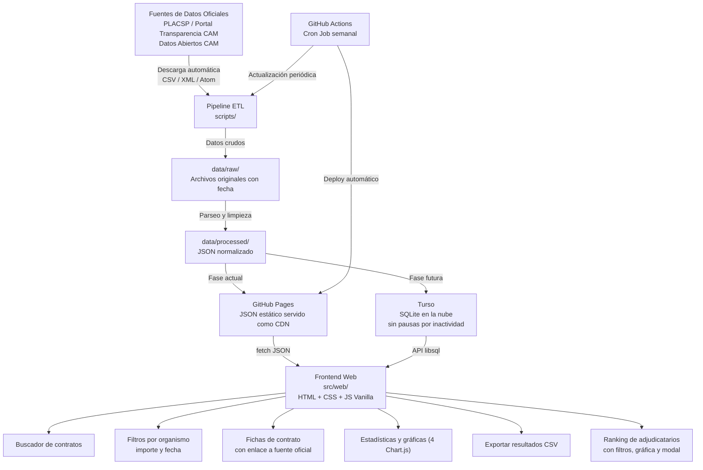
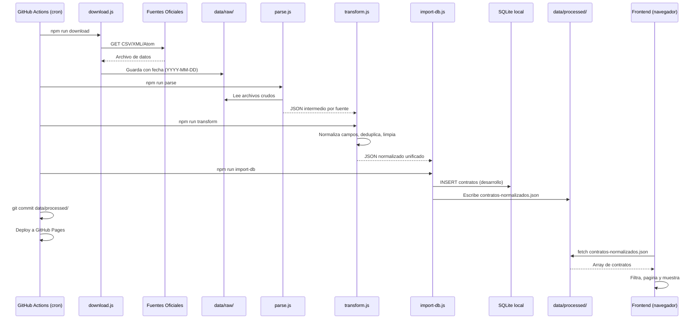

# Arquitectura Técnica — ContratosCAM

## Visión General

**ContratosCAM** es una herramienta cívica de transparencia pública que descarga, procesa y visualiza los datos de contratación pública de la Comunidad de Madrid. Su objetivo es hacer accesible a cualquier ciudadano, periodista o investigador la información sobre cómo se gasta el dinero público, sin necesidad de registro ni instalación.

El proyecto es completamente open source. La metodología de obtención y procesamiento de datos es auditable por cualquier persona.

Inspirado en [contratosdecantabria.es](https://contratosdecantabria.es) de Jaime Gómez-Obregón.

---

## Principios de Diseño

1. **Transparencia total** — El código que procesa los datos es público y auditable. Cualquiera puede verificar que los datos no han sido manipulados.
2. **Acceso sin fricción** — La web funciona sin registro, sin instalación, sin cookies de seguimiento.
3. **Reproducibilidad** — Cualquier persona con Node.js puede ejecutar el pipeline completo y obtener los mismos resultados.
4. **Escalado progresivo** — Empezar simple (JSON estático) y añadir complejidad solo cuando el volumen de datos lo justifique.
5. **Coste cero** — El proyecto debe poder mantenerse sin financiación, usando únicamente servicios gratuitos.

---

## Diagrama de Arquitectura del Sistema



---

## Stack Tecnológico

| Capa | Tecnología | Justificación |
|------|-----------|---------------|
| **Scraping / ETL** | Node.js 20+ (ESM) + `csv-parse` + `fast-xml-parser` v5 | Sin dependencias nativas, funciona en GitHub Actions |
| **Validación** | `scripts/validate.js` (schema checking) | Garantiza integridad de datos antes de publicar |
| **Base de datos local** | SQLite via `sql.js` (WebAssembly) | Sin compilación nativa, portátil, un solo archivo |
| **Base de datos en la nube (futura)** | Turso | SQLite gestionado, sin pausas, tier gratuito generoso |
| **Frontend** | HTML + CSS + JS Vanilla | Sin build step, auditable, deploy directo en GitHub Pages |
| **Gráficas** | Chart.js 4.4 (CDN con SRI) | Ligero, sin dependencias de build, integridad verificada |
| **Deploy** | GitHub Pages (solo `src/web/` + `data/processed/`) | Gratuito, CDN global, sin exponer código del pipeline |
| **CI/CD** | GitHub Actions | Gratuito, actualización semanal automática + validación |

### ¿Por qué no React, Vue o Next.js?

El frontend no usa ningún framework de forma deliberada:

- **GitHub Pages sirve archivos estáticos** — No hay servidor Node.js, no hay paso de compilación. `index.html` se abre directamente.
- **El estado es simple** — Un objeto con `datos[]`, `filtros` activos y `paginaActual`. No justifica un framework reactivo.
- **Auditabilidad** — Cualquier persona puede leer el código fuente en el navegador sin sourcemaps ni transpilación.
- **Barrera de entrada baja** — Un contribuidor que sepa HTML y JS básico puede entender y modificar el frontend.

### ¿Por qué Turso y no Supabase?

| Criterio | Turso | Supabase |
|---|---|---|
| **Pausas por inactividad** | ❌ No existen | ⚠️ Pausa tras 7 días sin actividad |
| **Compatibilidad** | SQLite (mismo esquema que el proyecto) | PostgreSQL (requiere migración) |
| **Tier gratuito** | 9 GB, 500M filas, 1 GB transferencia/mes | 500 MB, 2 GB transferencia/mes |
| **Clave API en frontend** | Token de solo lectura seguro | `anon key` requiere configurar RLS |
| **Adecuado para datos públicos** | ✅ | ✅ con configuración adicional |

Para una herramienta cívica con tráfico esporádico, las pausas de Supabase son inaceptables: un periodista que accede tras días de inactividad encontraría la web lenta o caída.

---

## Estrategia de Escalado Progresivo

### Fase 1 — JSON estático (implementación actual)

```
GitHub Actions → scripts ETL → data/processed/contratos-normalizados.json → GitHub Pages → Frontend
```

**Cuándo es suficiente:** hasta ~50.000 contratos (~25 MB de JSON comprimido).

**Ventajas:**
- Cero dependencias externas
- Disponibilidad 100% (CDN de GitHub)
- Sin claves API ni configuración de servicios externos
- El JSON es auditable directamente en el repositorio

**Limitaciones:**
- No es viable para datos históricos completos (varios años)
- La búsqueda full-text es limitada (filtrado en memoria en el cliente)
- GitHub Pages tiene límite de 1 GB por repositorio

### Fase 2 — Turso (cuando el volumen lo justifique)

```
GitHub Actions → scripts ETL → Turso (SQLite cloud) → API libsql → Frontend
```

**Cuándo migrar:** cuando el JSON supere ~20 MB o se quieran añadir datos históricos de varios años.

**Cambios necesarios:**
- Añadir `@libsql/client` como dependencia
- Modificar `scripts/import-db.js` para insertar en Turso además de SQLite local
- Modificar `cargarDatos()` en `src/web/js/app.js` para usar el cliente libsql
- Configurar el token de solo lectura como variable de entorno en GitHub Actions y como constante en el frontend

**Lo que NO cambia:** el esquema de datos, el pipeline ETL, el frontend (salvo la función de carga), el deploy en GitHub Pages.

---

## Estructura de Directorios

```
contratoscam/
├── .github/
│   └── workflows/
│       └── update-data.yml       # GitHub Action: ETL semanal + validación + deploy Pages
├── data/
│   ├── raw/                      # Datos descargados sin procesar (gitignored)
│   │   └── .gitkeep
│   ├── processed/                # JSON normalizado (commiteado al repo)
│   │   ├── .gitkeep
│   │   └── contratos-normalizados.json   # 1.393 contratos reales de la CAM (~1 MB)
│   └── db/
│       └── contratos.db          # SQLite local para desarrollo (gitignored)
├── docs/
│   ├── fuentes-datos.md          # Guía de fuentes de datos oficiales
│   └── capturas/                 # Screenshots para el README
├── plans/
│   ├── arquitectura.md           # Este archivo
│   ├── PRD.md                    # Product Requirements Document
│   └── roadmap.md                # Hoja de ruta por fases
├── scripts/
│   ├── download.js               # Descarga datos (con timeout y validación)
│   ├── parse.js                  # Parsea CSV/XML/Atom a JSON intermedio
│   ├── transform.js              # Limpia, normaliza y deduplica
│   ├── import-db.js              # Importa a SQLite (ESM nativo)
│   └── validate.js               # Valida schema e integridad del JSON
├── src/
│   └── web/
│       ├── index.html            # Página principal (buscador, filtros, tabla, gráficas)
│       ├── ranking.html          # Página de ranking de adjudicatarios
│       ├── css/
│       │   └── styles.css        # Estilos con variables CSS, responsive (900/600/400px)
│       └── js/
│           ├── app.js            # Lógica del buscador principal
│           └── ranking.js        # Lógica del ranking de adjudicatarios (730 líneas)
├── .gitignore
├── .nvmrc                        # Versión de Node.js (20)
├── package.json
└── README.md
```

---

## Flujo de Datos (ETL)



---

## Modelo de Datos

### Esquema normalizado (JSON y SQLite)

```sql
CREATE TABLE contratos (
    id                  INTEGER PRIMARY KEY AUTOINCREMENT,
    expediente          TEXT,
    objeto              TEXT NOT NULL,
    tipo                TEXT,           -- obras | servicios | suministros | administrativo_especial
    procedimiento       TEXT,           -- abierto | abierto_simplificado | negociado | menor
    organismo           TEXT NOT NULL,
    importe             REAL,           -- Sin IVA, en euros
    importe_iva         REAL,           -- Con IVA, en euros
    adjudicatario       TEXT,
    nif_adjudicatario   TEXT,
    fecha_publicacion   TEXT,           -- ISO 8601: YYYY-MM-DD
    fecha_adjudicacion  TEXT,
    fecha_formalizacion TEXT,
    url_origen          TEXT,           -- Enlace al anuncio oficial
    fuente              TEXT,           -- placsp | cam_transparencia | cam_datos_abiertos
    created_at          TEXT DEFAULT CURRENT_TIMESTAMP
);

-- Índices para búsqueda rápida
CREATE INDEX idx_organismo ON contratos(organismo);
CREATE INDEX idx_tipo ON contratos(tipo);
CREATE INDEX idx_fecha ON contratos(fecha_publicacion);
CREATE INDEX idx_importe ON contratos(importe);
CREATE INDEX idx_adjudicatario ON contratos(adjudicatario);

-- Búsqueda full-text (SQLite FTS5)
CREATE VIRTUAL TABLE contratos_fts USING fts5(
    objeto, organismo, adjudicatario,
    content='contratos', content_rowid='id'
);
```

### Tabla de organismos (normalización futura)

```sql
CREATE TABLE organismos (
    id      INTEGER PRIMARY KEY AUTOINCREMENT,
    nombre  TEXT NOT NULL UNIQUE,
    nombre_normalizado TEXT,    -- Nombre canónico para deduplicación
    tipo    TEXT,               -- consejeria | organismo_autonomo | empresa_publica | ayuntamiento
    web     TEXT
);
```

---

## Consideraciones Técnicas

### Calidad de datos

Los datos de fuentes públicas tienen problemas conocidos que el pipeline debe resolver:

| Problema | Solución en transform.js |
|----------|--------------------------|
| Importes como texto con comas (`45.000,00`) | Reemplazar `.` y `,`, parsear a float |
| Fechas en `DD/MM/YYYY` | Convertir a `YYYY-MM-DD` (ISO 8601) |
| Nombres de organismos inconsistentes | Tabla de equivalencias + normalización |
| NIF con guiones o espacios | Eliminar caracteres no alfanuméricos |
| Campos vacíos como string vacío | Convertir a `null` |
| Duplicados entre fuentes | Deduplicar por `expediente` + `organismo` |

### Seguridad del frontend

- **XSS:** Todos los valores de datos se escapan con `esc()` antes de insertarse en el DOM.
- **CSV injection:** Los valores exportados se prefijan con `'` si empiezan por `=`, `+`, `-`, `@`.
- **URL injection:** Las URLs de origen se validan con `sanitizarUrl()` para permitir solo `http://` y `https://`.
- **Supply-chain:** Chart.js se carga con Subresource Integrity (SRI) — hash SHA-384 verificado.
- **Meta headers:** `X-Content-Type-Options: nosniff` y `referrer: no-referrer` configurados.
- **Deploy aislado:** GitHub Pages solo recibe `src/web/` + `data/processed/`, nunca scripts del pipeline ni configuración interna.
- **Sin datos de usuario:** La aplicación no recoge ningún dato personal. No hay formularios de registro, no hay cookies de seguimiento.

### Validación de datos (pipeline)

- **Schema checking:** `scripts/validate.js` verifica campos requeridos, tipos de datos, formatos de fecha y URLs seguras.
- **Completitud:** Reporta porcentaje de campos rellenados para detectar degradación de fuentes.
- **Tamaño:** Advierte si el JSON supera 20 MB (umbral para migrar a Turso).
- **Integración CI:** Se ejecuta automáticamente en GitHub Actions antes del deploy.

### Rendimiento

- **Paginación:** 50 resultados por página para no saturar el DOM.
- **Debounce:** La búsqueda por texto espera 300ms antes de filtrar.
- **Índices SQLite:** Sobre `organismo`, `tipo`, `fecha_publicacion`, `importe` y `adjudicatario`.
- **JSON pre-procesado:** El frontend carga un único JSON ya normalizado, sin consultas adicionales.

### Legalidad y ética

- Los datos son **públicos** y de libre reutilización (Ley 37/2007, Ley 19/2013).
- Cada contrato incluye siempre el **enlace a la fuente oficial original**.
- Se respeta el `robots.txt` de los portales fuente.
- Se añaden delays entre peticiones para no sobrecargar los servidores públicos.
- Los datos no se modifican de forma que induzcan a error; solo se normalizan para facilitar la búsqueda.
